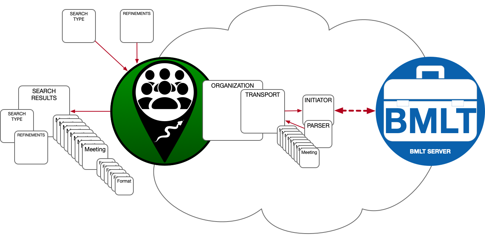

# ``LGV_MeetingSDK``

An adaptible SDK, for finding and listing regularly-occurring, scheduled events.

## Overview

This SDK provides a (mostly) protocol-based definition of an SDK that can be applied to low-level server connections, when the server provides information on regularly-scheduled (weekly) events.

The information is "commoditized" into a relatively straightforward structure, so different types of servers, with different behaviors, can be abstracted behind a common façade.

## Requirements

This is a [Swift](https://www.swift.org)-only SDK, and is meant to be used by native Swift Apple implementations. It will work for all Apple platforms ([iOS](https://apple.com/ios), [iPadOS](https://apple.com/ipados), [WatchOS](https://apple.com/watchos), [MacOS](https://apple.com/macos), and [TVOS](https://apple.com/tvos)).

There are no dependencies for the SDK, but [the test harness app](https://github.com/LittleGreenViper/LGV_MeetingSDK/tree/master/Tests/LGV_MeetingSDK_Test_Harness) has some dependencies:

- [RVS_Generic_Swift_Toolbox](https://riftvalleysoftware.com/work/open-source-projects/#toolbox)
- [RVS_UIKit_Toolbox](https://riftvalleysoftware.com/work/open-source-projects/#uikit)
- [RVS_Persistent_Prefs](https://riftvalleysoftware.com/work/open-source-projects/#RVS_PersistentPrefs)
- [RVS_Checkbox](https://riftvalleysoftware.com/work/open-source-projects/#RVS_Checkbox)

## What Is A "Meeting"?

For the purposes of this SDK, a meeting is a regularly-occurring event, happening at a certain physical location, or virtual venue (or both). The cadence is weekly.

There are provisions for "one-off" events, but these would best be handled by something like a calendar or scheduling system.

Meetings are associated with "Organizations."

## What Is An "Organization"?

This SDK is being developed in order to specifically address the technical needs of propagating scheduling information for 12-Step Recovery organizations, like [AA](https://aa.org) and [NA](https://na.org), however, it does not need to be restricted to these types of fellowships. It may also be used to "mix and match" meetings from different organizations.

## SDK Structure

The basic structure of the SDK, is an instance of the SDK, specialized for a certain API (for example, the [BMLT](https://bmlt.app) API), that will have an organization assigned. This organization will have a "transport" assigned, which takes care of querying the server, and parsing the response. It does this, via "initiators," and "parsers."

In the diagram above, we see the SDK being used as a connector to a [BMLT](https://bmlt.app) server.

A search is initiated by the user of the SDK, by providing a *Search Type*, and *Search Refinements*. These define the parameters of the search.

The SDK then gets the *Transport* instance from its *Organization* instance, and asks it to perform the search.

The *Transport* instance has an *Initiator* instance, as well as a *Parser* instance, that will take care of the actual interaction (in this case, HTTPS) with the *Meeting List Server* (in this case, a BMLT server instance).

The initiator knows how to translate the generic *Search Type* (and, possibly, the *Refinements*) into a server query, and sends a request to the *Meeting List Server* that satisfies the parameters of the requested search.

The server responds with an answer to the query (in this case, [JSON](https://www.json.org) data), which the *Initiator* sends to the *Parser*, which renders it into the basic object model that will be passed to the SDK user.

Each *Meeting* instance may have multiple *Format* instances attached. These are metadata that define various attributes of the meeting. It will also have at least one *Physical Venue*, or at least one *Virtual Venue*.

The response to the user is returned in a [Swift Completion Block](https://docs.swift.org/swift-book/ReferenceManual/Types.html#ID449).
